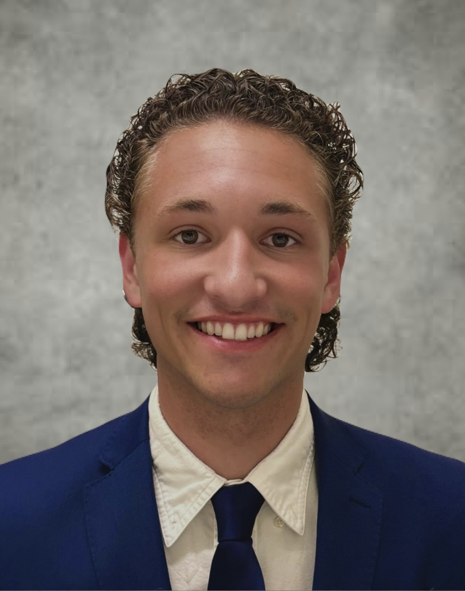

::: {.profile-hero}
::: {.profile-photo}

:::

::: {.profile-copy}
[INDUSTRIAL ENGINEERING · UNIVERSITY OF ARKANSAS]{.eyebrow}

# William Grady Hendrix

[An engineering perspective. A hands-on approach.]{.intro-line}

I'm an industrial engineering student at the University of Arkansas. I enjoy understanding how work gets done—and finding practical ways to improve it.

My internships with Archer Western have given me experience in field engineering and project management, including work on a $320 million water treatment project in South Mesquite. I'm interested in the connection between engineering decisions, efficient operations, and business results.

As an Eagle Scout and Kappa Sigma treasurer, I value responsibility and dependable leadership. I'm seeking a summer internship in oil and gas or field-based operations.

::: {.contact-links}
[LinkedIn](https://www.linkedin.com/in/grady-hendrix-690872351){.contact-link}
[GitHub](https://github.com/SwissCheeseIsHoly){.contact-link}
[Email me](mailto:gradyhendrix2@gmail.com){.contact-link .primary-link}
:::

::: {.contact-details}
[gradyhendrix2@gmail.com](mailto:gradyhendrix2@gmail.com) · [(469) 318-9680](tel:+14693189680)
:::
:::
:::
